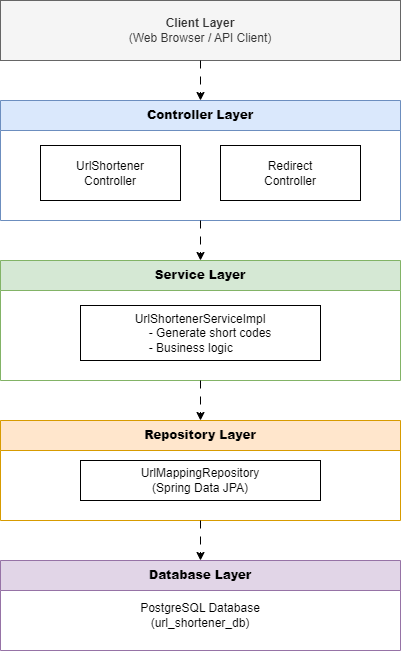

# 🚀 URL Shortener Application

<div align="center">


**Ứng dụng rút gọn URL hiện đại được xây dựng với Spring Boot & PostgreSQL**

[Demo](#-demo) • [Features](#-features) • [Tech Stack](#-tech-stack) • [Installation](#-installation--setup) • [API](#-api-endpoints)

</div>

---

## 📷 Demo

### API Testing với Postman

#### 1️⃣ Tạo URL rút gọn
```bash
POST http://localhost:8080/api/shorten
Content-Type: application/json

{
  "originalUrl": "https://github.com/VTNMT2930/urlshortener"
}
```

**Response:**
```json
{
  "shortCode": "x7Ks9mPq",
  "shortUrl": "http://localhost:8080/x7Ks9mPq",
  "originalUrl": "https://github.com/VTNMT2930/urlshortener"
}
```

#### 2️⃣ Redirect URL
```
Browser: http://localhost:8080/x7Ks9mPq
→ Tự động chuyển hướng đến: https://github.com/VTNMT2930/urlshortener
```

### Docker Deployment
```bash
# Khởi chạy application với Docker Compose
docker-compose up -d

# Kiểm tra containers đang chạy
docker ps

# Output:
# url-shortener-app  (Port 8080)
# postgres-db        (Port 5433)
```

---

## ✨ Features

### 🎯 Core Features
- ✅ **URL Shortening** - Rút gọn URL dài thành mã 8 ký tự ngẫu nhiên
- ✅ **Automatic Redirect** - Chuyển hướng tự động từ URL ngắn về URL gốc
- ✅ **Persistent Storage** - Lưu trữ dữ liệu bền vững với PostgreSQL
- ✅ **REST API** - API chuẩn RESTful với JSON response
- ✅ **Error Handling** - Xử lý lỗi toàn cục với Global Exception Handler

### 🔧 Technical Features
- ⚡ **High Performance** - Tối ưu hóa query với JPA/Hibernate
- 🔒 **Input Validation** - Validate URL đầu vào
- 🐳 **Docker Support** - Containerization với Docker Compose
- 📊 **Database Migration** - Auto-update schema với Hibernate DDL
- 🎨 **Clean Architecture** - Áp dụng các design patterns chuẩn

---

## 🛠 Tech Stack

### Backend
| Technology | Version | Purpose |
|------------|---------|---------|
| **Java** | 17 | Core programming language |
| **Spring Boot** | 3.5.4 | Backend framework |
| **Spring Data JPA** | 3.5.4 | ORM & Database access |
| **Hibernate** | 6.x | JPA implementation |
| **Lombok** | Latest | Reduce boilerplate code |

### Database
| Technology | Version | Purpose |
|------------|---------|---------|
| **PostgreSQL** | 17 | Primary database |

### DevOps & Tools
| Technology | Version | Purpose |
|------------|---------|---------|
| **Maven** | 3.6+ | Build tool & dependency management |
| **Docker** | Latest | Containerization |
| **Docker Compose** | Latest | Multi-container orchestration |

### Design Patterns
- **MVC Pattern** - Separation of concerns
- **Repository Pattern** - Data access abstraction
- **DTO Pattern** - Data transfer between layers
- **Service Layer Pattern** - Business logic encapsulation

---

## 🏗 System Architecture

<div align="center">
  
</div>

### Flow Diagram

```
User Request → Controller → Service → Repository → Database
                   ↓           ↓          ↓
              Validation   Business   Data Access
                           Logic
```

**Request Flow:**
1. Client gửi HTTP request tới Controller
2. Controller validate input và gọi Service layer
3. Service xử lý business logic (generate short code)
4. Repository thực hiện database operations
5. Response trả về theo chiều ngược lại

---

## 📂 Project Structure

```
urlshortener/
├── 📄 docker-compose.yml              # Docker orchestration configuration
├── 📄 Dockerfile                      # Container build instructions
├── 📄 pom.xml                         # Maven dependencies & build config
├── 📄 README.md                       # Project documentation
├── 📄 mvnw                            # Maven wrapper (Unix)
├── 📄 mvnw.cmd                        # Maven wrapper (Windows)
├── 📁 src/
│   ├── 📁 main/
│   │   ├── 📁 java/github/VTNMT2930/urlshortener/
│   │   │   ├── UrlshortenerApplication.java
│   │   │   ├── 📁 config/
│   │   │   ├── 📁 controller/
│   │   │   ├── 📁 dto/
│   │   │   ├── 📁 exception/
│   │   │   ├── 📁 model/
│   │   │   ├── 📁 repository/
│   │   │   └── 📁 service/
│   │   └── 📁 resources/
│   │       ├── application.properties  # Application configuration
│   │       ├── 📁 static/              # Static resources
│   │       └── 📁 templates/           # Template files
│   └── 📁 test/
│       └── 📁 java/github/VTNMT2930/urlshortener/
│           └── UrlshortenerApplicationTests.java
└── 📁 target/                         # Build output directory
    ├── 📁 classes/                    # Compiled classes
    ├── 📁 generated-sources/          # Generated source files
    └── 📁 test-classes/               # Compiled test classes
```

---

## ⚙️ Installation & Setup

### Prerequisites

| Requirement | Version | Notes |
|------------|---------|-------|
| Java JDK | 17+ | Required for compilation |
| Maven | 3.6+ | Build automation |
| Docker | Latest | For containerization (recommended) |
| PostgreSQL | 17 | If running without Docker |

---

### 🐳 Option 1: Run with Docker (Recommended)

**Bước 1:** Clone repository

```bash
git clone https://github.com/VTNMT2930/urlshortener.git
cd urlshortener
```

**Bước 2:** Khởi chạy ứng dụng

```bash
docker-compose up -d
```

**Bước 3:** Verify deployment

```bash
# Check running containers
docker ps

# View application logs
docker logs url-shortener-app

# Access application
curl http://localhost:8080/api/shorten
```

**Application is ready at:** `http://localhost:8080`

---

### 💻 Option 2: Run Locally (Without Docker)

**Bước 1:** Clone repository

```bash
git clone https://github.com/VTNMT2930/urlshortener.git
cd urlshortener
```

**Bước 2:** Cài đặt PostgreSQL và tạo database

```bash
# Cài đặt PostgreSQL và tạo database
createdb url_shortener_db
```

**Bước 3:** Cấu hình database

Chỉnh sửa file `src/main/resources/application.properties`:

```properties
spring.datasource.url=jdbc:postgresql://localhost:5432/url_shortener_db
spring.datasource.username=your_username
spring.datasource.password=your_password
```

**Bước 4:** Build và chạy ứng dụng

```bash
# Build project
mvn clean install

# Chạy ứng dụng
mvn spring-boot:run
```

**Bước 5:** Test the application

```bash
# Application runs on
http://localhost:8080
```

---

## 🗄 Database Schema

### Table: `url_mapping`

| Column | Type | Constraints | Description |
|--------|------|-------------|-------------|
| `id` | BIGINT | PRIMARY KEY, AUTO_INCREMENT | Unique identifier |
| `original_url` | VARCHAR(2048) | NOT NULL | Original long URL |
| `short_code` | VARCHAR(8) | UNIQUE, NOT NULL | Generated short code |
| `created_at` | TIMESTAMP | DEFAULT CURRENT_TIMESTAMP | Creation time |

### Entity Relationship
```
┌─────────────────────────────────┐
│         UrlMapping              │
├─────────────────────────────────┤
│ id: Long (PK)                   │
│ originalUrl: String             │
│ shortCode: String (Unique)      │
│ createdAt: Timestamp            │
└─────────────────────────────────┘
```

### Sample Data
```sql
-- Example records
INSERT INTO url_mapping (original_url, short_code, created_at) 
VALUES 
  ('https://github.com/VTNMT2930', 'aB3Xy9Qz', '2026-03-10 10:30:00'),
  ('https://www.example.com/long/path', 'xK9mP2Lq', '2026-03-10 11:45:00');
```

---

## 🔌 API Endpoints

### Base URL
```
http://localhost:8080
```

---

### 1️⃣ Create Short URL

**Endpoint:** `POST /api/shorten`

**Description:** Tạo một URL rút gọn từ URL gốc

**Request:**
```http
POST /api/shorten HTTP/1.1
Host: localhost:8080
Content-Type: application/json

{
  "originalUrl": "https://www.example.com/very/long/url/path"
}
```

**cURL Example:**
```bash
curl -X POST http://localhost:8080/api/shorten \
  -H "Content-Type: application/json" \
  -d '{"originalUrl": "https://github.com/VTNMT2930/urlshortener"}'
```

**Success Response:** `200 OK`
```json
{
  "shortCode": "x7Ks9mPq",
  "shortUrl": "http://localhost:8080/x7Ks9mPq",
  "originalUrl": "https://github.com/VTNMT2930/urlshortener"
}
```

**Error Responses:**

| Status Code | Description | Response Body |
|-------------|-------------|---------------|
| `400 Bad Request` | URL không hợp lệ hoặc thiếu | `{"message": "Invalid URL"}` |
| `500 Internal Server Error` | Lỗi server | `{"message": "Internal server error"}` |

---

### 2️⃣ Redirect to Original URL

**Endpoint:** `GET /{shortCode}`

**Description:** Chuyển hướng từ URL rút gọn về URL gốc

**Request:**
```http
GET /x7Ks9mPq HTTP/1.1
Host: localhost:8080
```

**cURL Example:**
```bash
curl -L http://localhost:8080/x7Ks9mPq
```

**Success Response:** `302 Found`
```http
HTTP/1.1 302 Found
Location: https://github.com/VTNMT2930/urlshortener
```

**Error Responses:**

| Status Code | Description | Response Body |
|-------------|-------------|---------------|
| `404 Not Found` | Không tìm thấy short code | `{"message": "URL not found"}` |

---

### API Testing

**Using Postman:**
1. Import collection từ file `postman_collection.json` (nếu có)
2. Hoặc tạo request thủ công theo documentation trên

**Using cURL:**
```bash
# Test create short URL
curl -X POST http://localhost:8080/api/shorten \
  -H "Content-Type: application/json" \
  -d '{"originalUrl": "https://example.com"}'

# Test redirect (should follow redirect with -L flag)
curl -L http://localhost:8080/{shortCode}
```

---

## 👨‍💻 Author

**Vo Trung Nhan (VTNMT2930)**

- GitHub: [@VTNMT2930](https://github.com/VTNMT2930)
- Email: nhantrung297@gmail.com

---

### 📊 Project Stats


---

### 🙏 Documentation

- [Spring Boot Documentation](https://spring.io/projects/spring-boot)
- [PostgreSQL Documentation](https://www.postgresql.org/docs/)
- [Docker Documentation](https://docs.docker.com/)
- [Baeldung Java Tutorials](https://www.baeldung.com/)

---

<div align="center">

**⭐ Nếu bạn thấy project hữu ích, hãy cho một star! ⭐**

Made with ❤️ by [VTNMT2930](https://github.com/VTNMT2930)

</div>
